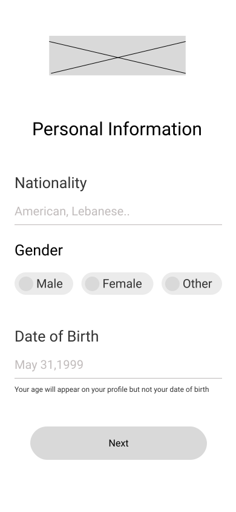
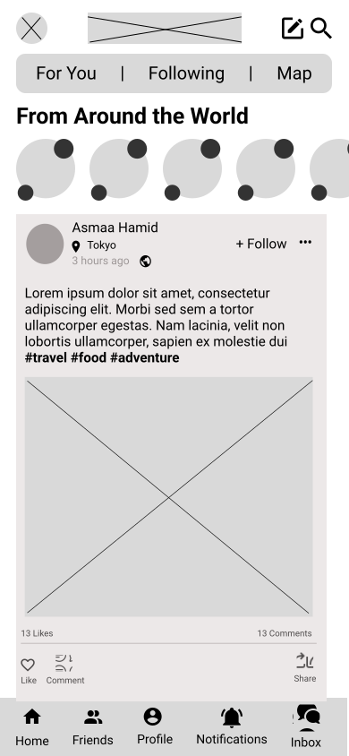
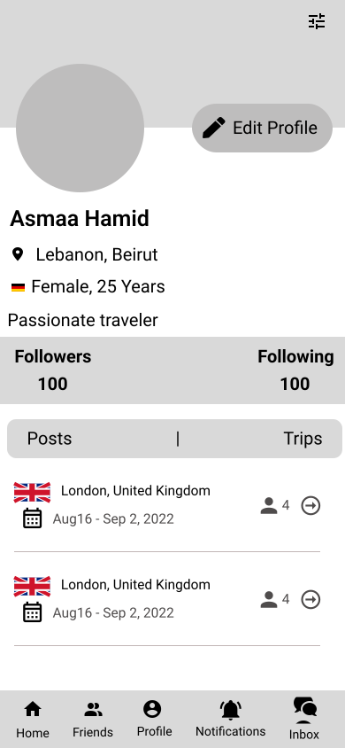
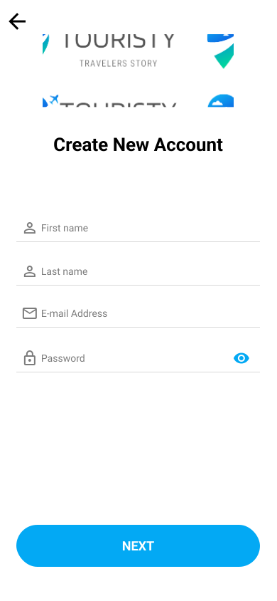
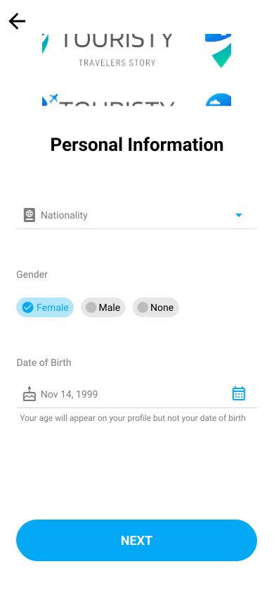
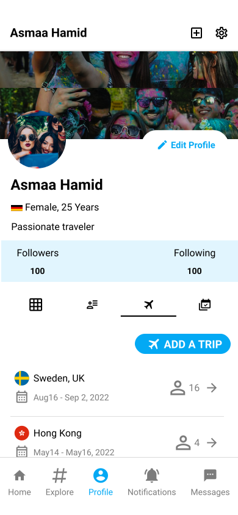

<div align="center">

> Touristy is your place to find new places and connect with travelers from around the world. It is your trips wallet.

**[PROJECT PHILOSOPHY](https://github.com/asmaahamid02/touristy#-project-philosophy) • [WIREFRAMES](https://github.com/asmaahamid02/touristy#-wireframes) • [TECH STACK](https://github.com/asmaahamid02/touristy#-tech-stack) • [IMPLEMENTATION](https://github.com/asmaahamid02/touristy#-impplementation) • [HOW TO RUN?](https://github.com/asmaahamid02/touristy#-how-to-run)**

</div>

<br><br>


> The Well app is a mental health and mindfulness app built on top of the science of positive psychology. The Well app is more than just another meditation or journaling app; it encourages you to enhance and reflect on your day with structured, guided activities.
>
> There are 5 daily tasks that the Well app asks you to complete each day: record 3 gratitudes, write a journal entry, perform 3 acts of kindness, exercise for 20 minutes, and meditate for 15 minutes.

### User Stories

- As a user, I want to browse posts, so that I can find new places to visit
- As a user, I want to create posts and comments, so that I can share my experiences
- As a user, I want to add new trip, so that I can find company and save my activities
- As a user, I want to start chat with other users, so that I can make friends
- As a user, I want to follow other users, so that I can see their activities
- As a user , I want to browse a map, so that I can see the users' activities locations

<br><br>


> This design was planned before on paper, then moved to Figma app for the fine details.
> Note that i didn't use any styling library or theme, all from scratch and using pure css modules and flutter widgets styling

| Landing | Signup | Home Page | Chat | Profile |
| -----------------------------------------| -----------------------------------------| -----------------------------------------|  -----------------------------------------| -----------------------------------------| 
|  |  |  |  |  |

| Landing | Signup | Home Page | Chat | Profile |
| -----------------------------------------| -----------------------------------------| -----------------------------------------|  -----------------------------------------| -----------------------------------------| 
|  |  |  |  |  |

<br><br>


Here's a brief high-level overview of the tech stack the Well app uses:

- This project uses the [Flutter app development framework](https://flutter.dev/). Flutter is a cross-platform hybrid app development platform which allows us to use a single codebase for apps on mobile, desktop, and the web.
- For database, the app uses the [MySQL](https://www.mysql.com/) database.
- For the live chat, the app uses [cloud_firestore](https://pub.dev/packages/cloud_firestore) plugin to use [Cloud Firestore API](https://firebase.google.com/docs/firestore/) which is a flexible, scalable database for mobile, web, and server development from Firebase and Google Cloud.
- The app uses the font [Mullish](https://fonts.google.com/specimen/Mulish) as its main font for light theme, and font [Inter](https://fonts.google.com/specimen/Inter) for dark theme, and the design of the app adheres to the material design guidelines.
- Packages used in the app:
  - [intel](https://pub.dev/packages/intl) for date formatting.
  - [image_picker](https://pub.dev/packages/image_picker) for selecting media from the device camera or storage.
  - [video_player](https://pub.dev/packages/video_player) for playing back video on a Widget surface.
  - [permission_handler](https://pub.dev/packages/permission_handler) for checking user's permissions given to the app.
  - [flag](https://pub.dev/packages/flag) to get the flag icon of a country from its code
  - [provider](https://pub.dev/packages/provider) for state management and reusability.
  - [http](https://pub.dev/packages/http) for HTTP requests
  - [shared_preferences](https://pub.dev/packages/shared_preferences) as persistent storage for simple data.
  - [timago](https://pub.dev/packages/timeago) for converting date into a humanized text.
  - [cached_network_image](https://pub.dev/packages/cached_network_image) to show images from the internet and keep them in the cache directory.
  - [google_fonts](https://pub.dev/packages/google_fonts)
    to use fonts from [Google Fonts](https://fonts.google.com/)
  - [fluttertoast](https://pub.dev/packages/fluttertoast) to display toast messages without BuildContext.
  - [collection](https://pub.dev/packages/collection) to work with collections and grouping data.
  - [geolocator](https://pub.dev/packages/geolocator) to get the current position of the user.
  - [geocoding](https://pub.dev/packages/geocoding) to convert longitude and latitude to a human readable address.
    - Your device should support a connection with Google Play Services.
  - [google_maps_flutter](https://pub.dev/packages/google_maps_flutter) to use GoogleMap Widget.

<br><br>


> Uing the above mentioned tech stacks and the wireframes build with figma from the user sotries we have, the implementation of the app is shown as below, these are screenshots from the real app

| Landing                                                                                | Home/Search                                                                               |
| -------------------------------------------------------------------------------------- | ----------------------------------------------------------------------------------------- |
|  |  |

<br><br>


> Follow the below steps in order to run the application and use it.

### Prerequisites

1. You need to install Flutter in order to be able to run this app.
   - Follow the steps listed here - [Fluute Install](https://docs.flutter.dev/get-started/install)
   - *Setup an Emulator/Use Phone that supports Google Play Services*
2. PHP v7+   
2. Intall XAMPP for installing PHP and creating the database from here - [XAMPP isnatall](https://www.apachefriends.org/download.html)   
3. Install Composer for PHP dependencies from here - [Composer Install](https://getcomposer.org/)


### Installation

1. Clone the repo
   ```sh
   git clone https://github.com/asmaahamid02/touristy.git
   ```
2. Create database in **phpmyadmin** named **touristydb**

3. Navigate to server folder   
   ```sh
   cd touristy_backend
   ```
4. Install dependencies
   ```sh
   composer install 
   ```
5. Rename **.env.example** to **.env**

6. Add database configuration inside **.env**
   * DB_DATABASE=touristydb
   * DB_USERNAME=*Your_Username*
   * DB_PASSWORD=*Your_Password*

7. Run migrations and seeders
   ```sh
   php artisan migrate --seed 
   ```
8. Run server
   ```sh
   php artisan serve
   ```
9. Navigate to app folder   
   ```sh
   cd touristy_frontend
   ```
10. Get packages
    ```sh
    flutter pub get
    ```
11. Run the app
     ```sh
     flutter run
     ```
